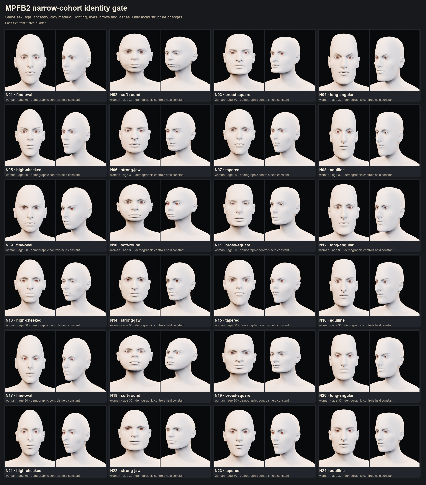
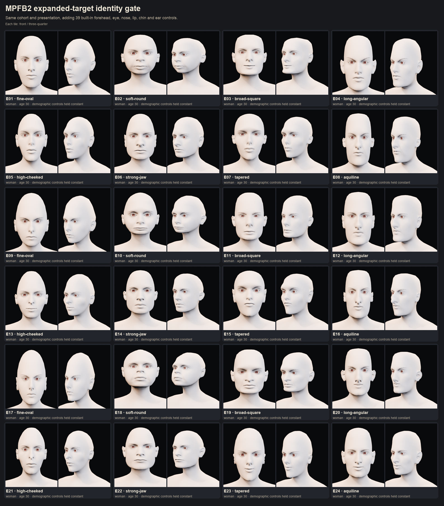
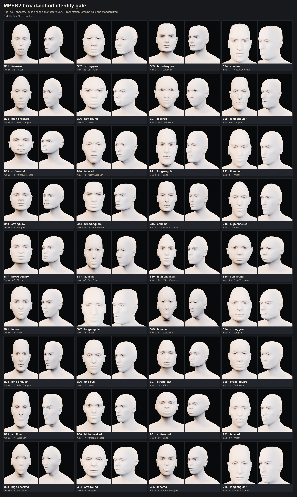
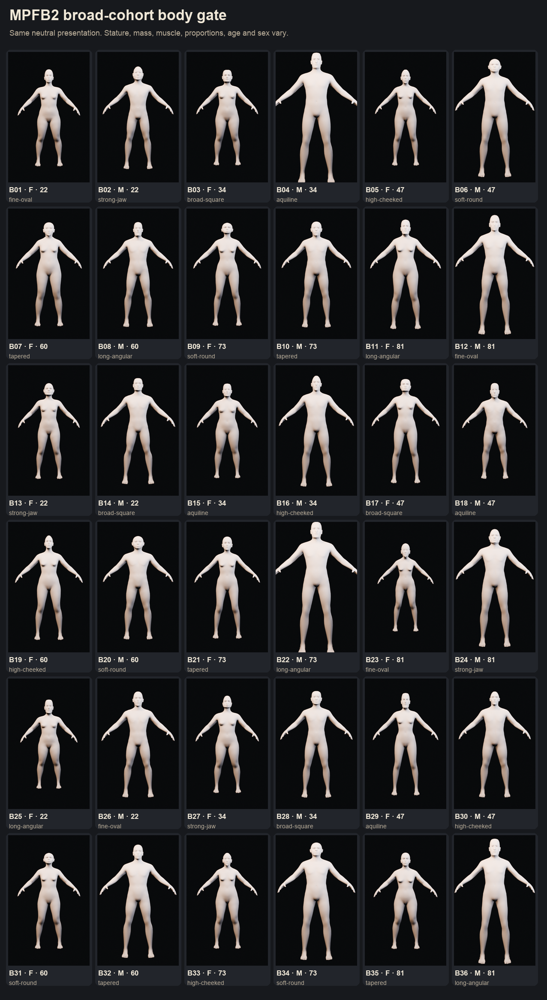

# Renderer C identity research

Date: 2026-08-07

## Decision

Do not build Renderer C around stock MPFB randomization alone. Keep MPFB for the
body, rig, clothing fit, face units, and fixed export topology, but add a bank of
coherent full-face identity targets derived offline from Google GNM Head.

The intended Renderer C stack is:

1. Sample and curate distinct adult identities with GNM Head, conditioned on its
   `WHITE` and female/male labels.
2. Transfer selected complete head shapes onto the MPFB basemesh as custom
   MakeTarget anchors.
3. Add MPFB's local detail controls and the CC0 Cheek 01, Ears 01, and Nose 01
   packs for secondary variation.
4. Use MPFB age and surface-texture controls independently. GNM's current
   semantic identity sampler exposes gender and ethnicity, not age.
5. Keep only a useful morph subset in consultation LODs. Bake identity into
   nearby and crowd LODs.

This preserves the parts of MPFB that already work while replacing its weakest
part: the distribution from which identities are generated.

## What the local test found

The identity gate renders heads bald, neutral, in the same material and lighting.
This intentionally removes hair, color, expression, and demographic differences
that can make one underlying face look more varied than it is.

- Baseline: 24 European-ancestry women, all age 30, generated with the smaller
  control set inherited from Renderer A.
- Expanded: the same cohort after adding 39 underused system controls across the
  forehead, eye corners and folds, three nose zones, nostrils, lips, chin, ears,
  and mild asymmetry.
- Broad: 36 mixed demographic and body examples, retained only as a comparison.

The expanded controls materially improve spread. The closest front-view image
pair fell from 0.9972 to 0.9900 similarity, and pairs above the experiment's
0.995 near-duplicate threshold fell from one to zero. Minimum normalized head
geometry distance increased from 0.0254 to 0.0380. These are simple regression
diagnostics, not face-recognition scores.

The visual result is more important: the expanded set has better variation in
ears, eye corners, nose construction, lip shape, forehead, and asymmetry, but the
heads still share a recognizable MPFB family resemblance. Pushing the sliders
further tends to create caricatures rather than plausible new people.

Baseline narrow cohort:

Expanded system-target cohort:

The broad body test indicates that MPFB's body variation is adequate for this
project. It should not be discarded because its head identity prior is weak.

The complete generated measurements are in
`artifacts/renderer-c-identity-gate/baseline-manifest.json` and
`artifacts/renderer-c-identity-gate/expanded-manifest.json`.

## MPFB levers that were missing

Renderer A used only a fraction of the available facial system targets. Useful
omissions include forehead height and prominence, temple volume, brow depth,
inner and outer eye-corner height, bags and folds, nose-base height and
compression, nostril angle and flare, nose hump, independent upper/middle/lower
nose width, mouth height, mouth-corner angle, Cupid's-bow width, separate upper
and lower lip dimensions, chin bone and cleft, ear dimensions, and localized
asymmetry.

These should be added to the generator regardless of the identity-source
decision. They are valuable finishing controls, but they are not a substitute
for coherent identity anchors.

The official CC0 asset catalogue also contains realistic Cheek 01, Ears 01, and
Nose 01 deformation packs. It does not list a pack of complete, varied realistic
face identities. The current MPFB 2.0.17 randomizer is reproducible and can batch
up to 100 people, but it only randomizes bundled system targets, not target packs.
It is useful automation, not a richer face model.

MPFB's official MakeTarget workflow can store topology-preserving custom targets.
For large head changes, the helper geometry and joint markers must move with the
head. That makes coherent custom face anchors feasible without abandoning the
MPFB rig and asset-fitting ecosystem.

Sources:

- [Official MPFB asset packs](https://static.makehumancommunity.org/assets/assetpacks.html)
- [MPFB 2.0.17 randomization and its limitation](https://static.makehumancommunity.org/mpfb/releases/release_2017.html)
- [Official MakeTarget workflow](https://static.makehumancommunity.org/mpfb/docs/assets/creating_a_target.html)
- [MPFB targets and phenotype controls](https://static.makehumancommunity.org/mpfb/docs/assets/concept_targets.html)

## Why GNM Head is the best free identity source

GNM Head is a statistical head model trained from 3D scans rather than a single
artist-authored average plus semantic feature sliders. Its technical report says
the training data covers more than 5,000 people and about 150,000 neutral and
expressive samples. It is Apache-2.0 licensed, includes skin, eyeballs, teeth, and
tongue, and separates identity from expression. Version 3 exposes 170
head-identity components and a learned identity sampler with female/male and four
broad ethnicity labels, including `WHITE`.

That directly addresses the narrow-cohort problem: sampling can yield different
people while keeping the requested demographic category fixed. It is also much
closer to the desired mental model than independently selecting “large chin,”
“small nose,” and similar attributes.

GNM should be an offline source, not the runtime character system. Shipping its
full 253-dimensional identity vector and 383-dimensional expression model to
every mobile character would work against the project's LOD and download goals.
The lower-risk bridge is to transfer selected GNM identities to MPFB topology and
retain MPFB animation and clothing.

Sources:

- [Google GNM repository and license](https://github.com/google/GNM)
- [GNM Head model, semantic sampler, and dimensions](https://github.com/google/GNM/blob/main/gnm/shape/README.md)
- [GNM identity sampler labels](https://github.com/google/GNM/blob/main/gnm/shape/semantic_sampler.py)
- [GNM Head technical report](https://arxiv.org/abs/2607.23687)

## Proposed anchor bank

Start with a bounded proof rather than a full production generator:

1. Generate about 200 neutral GNM candidates for `WHITE` female and 200 for
   `WHITE` male with reproducible seeds.
2. Reject implausible extremes, then select 12 to 16 maximally separated faces
   per sex using geometry distance, standardized renders, and human review.
3. Transfer those complete head shapes to MPFB and save them as coherent custom
   targets, including neck seam, helpers, eye centers, and facial joint markers.
4. Test each anchor against the 52 Faceunits, blinking, eye aim, teeth, brows,
   lashes, and two representative 1896 hairstyles. Add correctives where needed.
5. For a patient, use one dominant anchor, at most a small secondary blend, then
   apply restrained local MPFB controls. Do not average many anchors together,
   which would converge back toward the generic face.
6. Build age as a separate layer: geometry and skin detail for 20s, 30s, 40s,
   50s, and 60. Curate the GNM samples visually because its semantic sampler does
   not currently provide an age class.

For the web build, consultation characters can retain the chosen anchor and a
curated set of roughly 25 to 40 live identity controls plus expression morphs.
Nearby and crowd characters should have identity baked into the mesh and retain
only the animation needed at that LOD.

## Alternatives considered

CharMorph is the only free Blender alternative worth a small comparison. It has
realtime morphing and asset fitting, hairstyles, alternative topology support,
and a Rigify face rig. However, it uses MB-Lab's artist-authored morph database,
so it may reproduce the same cluster problem rather than solve it. Its rig is
also only added at finalization. Use it only as a narrow-cohort benchmark if the
GNM-to-MPFB transfer proves impractical.

The original MB-Lab repository was archived in July 2024 and should not become a
new production dependency.

Sources:

- [CharMorph repository and limitations](https://github.com/Upliner/CharMorph)
- [Archived MB-Lab repository](https://github.com/animate1978/MB-Lab)

## Go/no-go gate

Renderer C should proceed only if the first eight transferred anchors pass these
checks:

- all eight are immediately recognizable as different people when bald, neutral,
  and rendered with identical clay material;
- none needs an extreme local slider value to look distinct;
- blinks, eye aim, speech mouth shapes, and at least six emotional expressions
  remain anatomically credible;
- the same eyebrow, lash, eyeball, teeth, and hair fitting process succeeds for
  every anchor;
- consultation, nearby, and crowd exports stay inside the eventual agreed web
  budgets.

If this gate fails, the next experiment should use GNM heads directly on MPFB
bodies. It should not be another round of stronger MPFB randomization.
